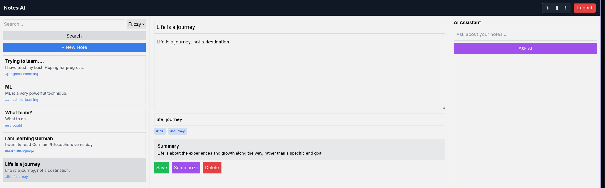

# 📘 Notes AI — Intelligent Note-Taking with LLM Integration

A full-stack note-taking application that combines **structured personal knowledge management** with **LLM-powered insights**.

The system allows users to:

* Create and manage notes
* Search using flexible (fuzzy/exact) matching
* Query their own notes using AI
* Generate summaries automatically
* Organize knowledge via tags
* Experience a clean UI with multiple themes


---

# 🚀 Core Idea

Traditional note apps are **storage systems**.

This project transforms notes into a **queryable knowledge base**:

[
\text{Notes} \rightarrow \text{Context} \rightarrow \text{LLM Reasoning}
]

Instead of just retrieving notes, users can **ask questions about their knowledge**.

---

# ✨ Features

## 🔐 Authentication

* JWT-based login & signup
* Protected routes
* Token-based API access

---

## 📝 Notes System

* Create, update, delete notes
* Optional title (Google Keep style)
* Auto-save with debounce
* Tag-based organization

---

## 🔎 Search Engine

* **Fuzzy search** → matches unordered words
* **Exact search** → phrase matching

Example:

```
Query: "learn ML"
```

* Fuzzy → matches "I want to learn machine learning"
* Exact → matches exact phrase only

---

## 🤖 AI Integration

### 1. Ask AI (Context-Aware)

Query all notes:

```
"What are my goals?"
```

→ LLM reads user notes and responds intelligently

---

### 2. Note Summarization

Each note can be summarized using LLM:

[
\text{Long Note} \rightarrow \text{Compressed Insight}
]

---

## 🏷️ Tagging System

* Add comma-separated tags
* Click tag → auto-search
* Improves retrieval structure

---

## 🎨 UI / UX

* Clean 3-panel layout:

  * Left → Notes list
  * Center → Editor
  * Right → AI assistant
* Theme modes:

  * ☀️ Light
  * 🌙 Dark
  * 📜 Sepia

---

## ⚡ Performance Enhancements

* Debounced auto-save
* Rate limiting (backend)
* Redis caching (optional layer)

---

# 🏗️ Architecture

## 🔷 Backend (Node.js + Express)

```
src/
├── controllers/
├── routes/
├── models/
├── middleware/
├── services/
├── config/
```

### Key Components:

* Express API server
* MongoDB (Mongoose models)
* Redis (rate limiting / caching)
* JWT authentication
* LLM service abstraction

---

## 🔷 Frontend (React + Tailwind)

```
client/
├── pages/
│   ├── Login.js
│   ├── Signup.js
│   └── Main.js
├── api.js
```

### Key Design:

* Component-based layout
* Axios for API communication
* LocalStorage token persistence
* State-driven UI

---

## 🔷 System Flow

[
\text{User Input} \rightarrow \text{Frontend} \rightarrow \text{API} \rightarrow \text{DB / LLM} \rightarrow \text{Response}
]

---

# 🛠️ Tech Stack

### Backend

* Node.js
* Express.js
* MongoDB (Mongoose)
* Redis
* JWT

### Frontend

* React
* Tailwind CSS
* Axios

### DevOps

* Docker
* Docker Compose

---

# ⚙️ Setup Instructions

## 1. Clone Repo

```bash
git clone <your-repo-url>
cd notes-saas
```

---

## 2. Run Backend (Docker)

```bash
docker compose up --build
```

Check:

```bash
curl http://localhost:5000/health
```

---

## 3. Run Frontend

```bash
cd client
npm install
npm start
```

Runs at:

```
http://localhost:3000
```

---

# 🔑 API Endpoints

## Auth

```
POST /api/auth/signup
POST /api/auth/login
```

## Notes

```
GET    /api/notes
POST   /api/notes
PUT    /api/notes/:id
DELETE /api/notes/:id
GET    /api/notes/search?q=&mode=
```

## LLM

```
POST /api/llm/query-notes
POST /api/llm/summarize-note/:id
GET  /api/llm/summarize-notes
```

---

# 🧠 Design Decisions

## 1. Debounced Auto-Save

Instead of explicit save:

[
\text{Typing} \rightarrow \text{Delay} \rightarrow \text{Save}
]

Reduces:

* API calls
* user friction

---

## 2. Queryable Notes via LLM

We treat notes as:

[
\text{Unstructured Data} \rightarrow \text{Semantic Context}
]

This enables:

* reasoning
* summarization
* knowledge extraction

---

## 3. Fuzzy vs Exact Search

Provides tradeoff:

[
\text{Recall} \leftrightarrow \text{Precision}
]

---

## 4. Stateless Auth (JWT)

Ensures:

* scalability
* decoupled frontend/backend

---

# 📦 Future Improvements

* Vector search (embeddings)
* Chat history memory
* Collaborative notes
* Real-time sync (WebSockets)
* Offline support

---

# 🎯 Demo Flow (For Submission)

1. Signup / Login
2. Create notes
3. Add tags
4. Search (fuzzy vs exact)
5. Ask AI about notes
6. Summarize note
7. Switch themes

---

# 👨‍💻 Author

Rupesh Das
Computer Science Researcher & Developer

---

# 📄 License

MIT License

---

# ⭐ Final Note

This project demonstrates:

[
\text{Full-stack engineering} + \text{LLM integration} + \text{usable product design}
]

—not just a CRUD app, but a **knowledge interaction system**.

---

If you want, I can also generate:

* 🔥 **Resume bullet points**
* 🎤 **Viva explanation script**
* 📊 **Architecture diagram (for PPT)**

Just tell me 👍
